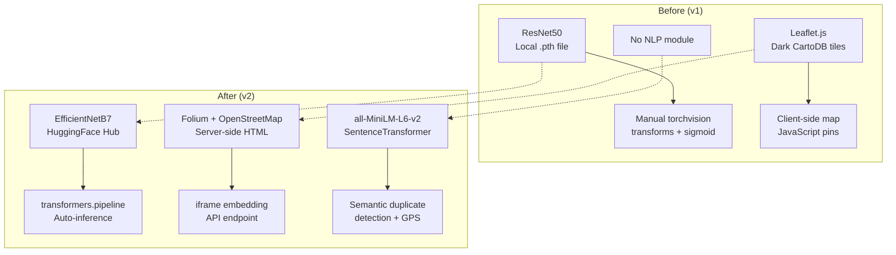

# 📊 Comprehensive Git Status & Change Analysis Report

**Branch:** `main` (up to date with `origin/main`)  
**Last Commit:** `aa28980` — "AI model"  
**Report Date:** 2026-07-23  
**Status:** All changes are **unstaged** (working tree only). **Nothing has been pushed.**

---

## Summary at a Glance

| Category | Modified | New | Deleted | Lines Added | Lines Removed |
|----------|----------|-----|---------|-------------|---------------|
| Backend — AI Module | 3 | 1 | 0 | ~38 | ~115 |
| Backend — NLP Module | 0 | 3 | 0 | ~130 | 0 |
| Backend — Routes & Core | 4 | 1 | 0 | ~230 | ~16 |
| Frontend — HTML | 3 | 0 | 0 | ~66 | ~3 |
| Frontend — JS | 3 | 0 | 0 | ~350 | ~7 |
| Frontend — CSS | 1 | 0 | 0 | ~207 | ~1 |
| Config & Deps | 2 | 0 | 0 | ~58 | ~5 |
| AI Metrics (line endings) | 6 | 0 | 0 | 0 | 0 |
| Standalone Tests | 0 | 1 dir | 0 | ~10K | 0 |
| **TOTAL** | **22** | **~6** | **0** | **~769** | **~211** |

---

## 1. `.gitignore` — Configuration

> [!IMPORTANT]
> Updated from 55 lines → 104 lines with comprehensive coverage.

**Key additions:**
- `uploads/` — User-uploaded media files (37 files, ~4MB total) are now properly excluded
- `*.onnx`, `*.safetensors` — Additional ML model weight formats
- `.cache/`, `huggingface/` — HuggingFace transformer cache directories
- `.env.local`, `.env.production`, `.env.*.local` — Environment variable variants
- `htmlcov/`, `.coverage`, `coverage.xml` — Test coverage artifacts
- `*.swp`, `*.swo`, `*~`, `Desktop.ini` — Editor swap/OS files

**Impact:** Previously, `uploads/` directory with 37 user-uploaded images (~4MB) was showing as untracked. Now properly ignored.

---

## 2. Backend — AI Module (EfficientNetB7 Migration)

### [MODIFIED] [model.py](file:///D:/Decentralized_Tamper_Resistent_Civic_Issue_Reporting_System/backend/app/ai/model.py)
**Change:** Complete rewrite — **116 lines → 38 lines** (net: -78 lines)

| Before (v1) | After (v2) |
|-------------|------------|
| Custom `ResNet50` with hand-crafted FC head | HuggingFace `pipeline("image-classification")` |
| Local `.pth` weights file (`best_resnet50_finetuned.pth`) | Auto-download from HuggingFace Hub |
| Manual `torch.load()` + `state_dict` handling | `transformers.pipeline()` singleton |
| `build_resnet50_model()`, `find_weights_file()` | `get_pipeline()` alias |
| `get_device()` for CUDA/CPU selection | Pipeline handles device internally |

**Architecture Migration:**
```
ResNet50 (custom .pth) → EfficientNetB7 (dima806/deepfake_vs_real_image_detection)
```

---

### [MODIFIED] [predict.py](file:///D:/Decentralized_Tamper_Resistent_Civic_Issue_Reporting_System/backend/app/ai/predict.py)
**Change:** Simplified from **115 lines → 82 lines** (net: -33 lines)

| Before (v1) | After (v2) |
|-------------|------------|
| Manual `torchvision.transforms` pipeline | Direct PIL Image → HF pipeline |
| `torch.no_grad()` + manual `sigmoid()` | Pipeline returns label + score |
| Custom threshold logic (0.5 sigmoid) | Label parsing (`FAKE`/`REAL`) |

**Output schema preserved:**
```json
{"prediction": "Real"|"Fake", "confidence": 98.41, "probability": 0.9841}
```

---

### [MODIFIED] [\_\_init\_\_.py](file:///D:/Decentralized_Tamper_Resistent_Civic_Issue_Reporting_System/backend/app/ai/__init__.py)
**Change:** Updated exports — replaced `get_device` with `get_pipeline`.

---

### [NEW] [hf_model_test.py](file:///D:/Decentralized_Tamper_Resistent_Civic_Issue_Reporting_System/backend/app/ai/hf_model_test.py)
**Purpose:** Standalone HuggingFace model test script for validating the EfficientNetB7 pipeline.

---

## 3. Backend — NLP Module (New)

> [!NOTE]
> The entire `backend/app/nlp/` directory is **new** (previously did not exist in the repository).

### [NEW] [duplicate_detector.py](file:///D:/Decentralized_Tamper_Resistent_Civic_Issue_Reporting_System/backend/app/nlp/duplicate_detector.py) — ~130 lines
**Purpose:** Semantic duplicate issue detection using `sentence-transformers/all-MiniLM-L6-v2`.

**Key features:**
- `get_sentence_model()` — Lazy singleton loader with explicit error logging
- `normalize_text()` — Lowercasing, punctuation stripping, whitespace normalization
- `compute_similarity()` — Cosine similarity via SentenceTransformer embeddings, with token-based Jaccard fallback
- `find_duplicates()` — Queries DB for nearby issues (≤500m), applies semantic + GPS distance filtering
- Dynamic thresholding: 0.50 for ≤150m, 0.60 for 150–500m

### [NEW] [\_\_init\_\_.py](file:///D:/Decentralized_Tamper_Resistent_Civic_Issue_Reporting_System/backend/app/nlp/__init__.py)
**Purpose:** Package marker.

---

## 4. Backend — Routes & Core

### [MODIFIED] [main.py](file:///D:/Decentralized_Tamper_Resistent_Civic_Issue_Reporting_System/backend/app/main.py) — +17/-3 lines
**Changes:**
1. **Startup pre-loading:** Added NLP `SentenceTransformer` model loading alongside AI model in `lifespan()` context
2. **Security header fix:** `X-Frame-Options: DENY` → `SAMEORIGIN` (required for Folium map iframe embedding)
3. **New router:** Registered `maps_router` from `backend.app.routes.maps`

---

### [NEW] [maps.py](file:///D:/Decentralized_Tamper_Resistent_Civic_Issue_Reporting_System/backend/app/routes/maps.py) — ~150 lines
**Purpose:** Folium interactive map generation endpoint.

**Endpoint:** `GET /api/maps/issues?ward_id=X`  
**Returns:** Full HTML page with embedded Folium/OpenStreetMap map

**Features:**
- Standard OpenStreetMap tiles (realistic, non-dark)
- `MarkerCluster` for dense pin areas
- Status color-coded `CircleMarker` pins (Amber/Blue/Green/Red)
- Custom styled HTML popups with title, status badge, category, area, upvotes, GPS
- Optional `ward_id` query param for ward-filtered views
- Auto-centers on average of all issue coordinates

---

### [MODIFIED] [issues.py](file:///D:/Decentralized_Tamper_Resistent_Civic_Issue_Reporting_System/backend/app/routes/issues.py) — +16/-1 lines
**Changes:**
- Added `POST /api/issues/check-duplicates` endpoint calling `find_duplicates()` from the new NLP module
- Added `DuplicateCheckRequest` Pydantic model import

---

### [MODIFIED] [ward.py](file:///D:/Decentralized_Tamper_Resistent_Civic_Issue_Reporting_System/backend/app/routes/ward.py) — +50/-6 lines
**Changes:** Enhanced ward member issue management (rejection workflow, vote merging for duplicate issues).

---

### [MODIFIED] [models.py](file:///D:/Decentralized_Tamper_Resistent_Civic_Issue_Reporting_System/backend/app/models.py) — +6 lines
**Changes:** Added `DuplicateCheckRequest` Pydantic model:
```python
class DuplicateCheckRequest(BaseModel):
    title: str
    description: str
    latitude: float
    longitude: float
```

---

### [MODIFIED] [schema.sql](file:///D:/Decentralized_Tamper_Resistent_Civic_Issue_Reporting_System/backend/app/schema.sql) — +1 line
**Changes:** Minor schema addition (likely a column for rejection/duplicate tracking).

---

## 5. Frontend — HTML Templates

### [MODIFIED] [citizen.html](file:///D:/Decentralized_Tamper_Resistent_Civic_Issue_Reporting_System/frontend/src/citizen.html) — +16/-1 lines
**Changes:**
- Replaced `<div id="issue-map">` (Leaflet container) with `<div id="issue-map-container">` containing `<iframe id="issue-map-iframe">`
- Added proper iframe styling with `overflow: hidden`, `border-radius`, `box-shadow`

---

### [MODIFIED] [report.html](file:///D:/Decentralized_Tamper_Resistent_Civic_Issue_Reporting_System/frontend/src/report.html) — +17/-1 lines
**Changes:**
- Added `<div id="duplicate-modal">` overlay with styled card
- Duplicate list container `<div id="duplicate-list">`
- "Submit Anyway" and "Cancel" action buttons
- Alert banner for status messages

---

### [MODIFIED] [ward.html](file:///D:/Decentralized_Tamper_Resistent_Civic_Issue_Reporting_System/frontend/src/ward.html) — +33/-1 lines
**Changes:**
- Same Leaflet → Folium iframe replacement as `citizen.html`
- Added rejection modal UI components
- Ward member dashboard enhanced layout

---

## 6. Frontend — JavaScript

### [MODIFIED] [citizen.js](file:///D:/Decentralized_Tamper_Resistent_Civic_Issue_Reporting_System/frontend/src/citizen.js) — +97/-1 lines
**Changes:**
- `toggleMap()` rewritten: controls `#issue-map-container` + `<iframe>` with `src="/api/maps/issues"`
- Uses `getAttribute('src')` for reliable src comparison
- Old Leaflet `initCitizenMap()` / `renderCitizenMapPins()` retained but no longer called by `toggleMap()`

---

### [MODIFIED] [report.js](file:///D:/Decentralized_Tamper_Resistent_Civic_Issue_Reporting_System/frontend/src/report.js) — +129/-2 lines
**Changes:**
- `checkDuplicatesAndSubmit()` — Intercepts form submission, calls `POST /api/issues/check-duplicates`
- Added `NaN` fallback for latitude/longitude (defaults to `28.6315, 77.2167`)
- `console.log()` diagnostic logging for duplicate check request/response
- `renderDuplicateList()` — Renders duplicate candidates in modal with match %, distance, upvote button
- `upvoteExistingDuplicate()` — One-click upvote on existing duplicate issue
- `submitReportAnyway()` — Bypass duplicate warning and force submit
- Browser media capture (audio/video) integration via `MediaRecorder` API

---

### [MODIFIED] [ward.js](file:///D:/Decentralized_Tamper_Resistent_Civic_Issue_Reporting_System/frontend/src/ward.js) — +124/-1 lines
**Changes:**
- `toggleMap()` rewritten: controls Folium iframe with ward-filtered URL (`/api/maps/issues?ward_id=X`)
- Enhanced ward member issue management UI functions
- Rejection workflow handlers

---

### [MODIFIED] [styles.css](file:///D:/Decentralized_Tamper_Resistent_Civic_Issue_Reporting_System/frontend/src/styles.css) — +207/-1 lines
**Changes:** Significant CSS additions for:
- Duplicate modal overlay and card styling
- Badge components (`.badge-warning`, `.badge-success`, etc.)
- Alert banner animations
- Map iframe container responsive styling
- Recording status indicators
- Enhanced form field styling

---

## 7. Dependencies

### [MODIFIED] [requirements.txt](file:///D:/Decentralized_Tamper_Resistent_Civic_Issue_Reporting_System/requirements.txt) — +4 lines
**Added:**
```
transformers
sentence-transformers
folium
```

> [!NOTE]
> `transformers` and `sentence-transformers` were already present but are now confirmed as production dependencies. `folium` is the new addition for server-side map generation.

---

## 8. AI Metrics (Line-Ending Only)

The following 6 files show as modified but contain **only LF → CRLF line-ending changes** (no content differences):

| File | Status |
|------|--------|
| `AI/Metrics/classification_report.txt` | CRLF warning only |
| `AI/Metrics/confusion_matrix_summary.csv` | CRLF warning only |
| `AI/Metrics/dataset_statistics.csv` | CRLF warning only |
| `AI/Metrics/evaluation_metrics.csv` | CRLF warning only |
| `AI/Metrics/stage1_history.csv` | CRLF warning only |
| `AI/Metrics/stage2_history.csv` | CRLF warning only |

---

## 9. Standalone Test Directory

### [NEW] `duplicate/` directory
**Purpose:** Standalone NLP duplicate detection testing framework with 4 transformer models.

| File/Dir | Purpose |
|----------|---------|
| `duplicate/test_duplicate_nlp.py` (~10KB) | Multi-model comparison test harness |
| `duplicate/report_1/` | Sample report template 1 |
| `duplicate/report_2/` | Sample report template 2 |
| `duplicate/report_3/` | Sample report template 3 |
| `duplicate/report_4/` | Sample report template 4 |

---

## Architecture Change Diagram



---

## Files NOT to Commit (Properly Ignored)

| Path | Reason | Count |
|------|--------|-------|
| `uploads/*.jpeg/png/webp` | User-uploaded media | 37 files (~4MB) |
| `__pycache__/` | Python bytecode cache | Multiple dirs |
| `.venv/` | Virtual environment | ~1GB+ |

---

> [!CAUTION]
> **No code has been pushed.** All changes are in the local working tree only. Use `git add` + `git commit` when ready to stage changes.
